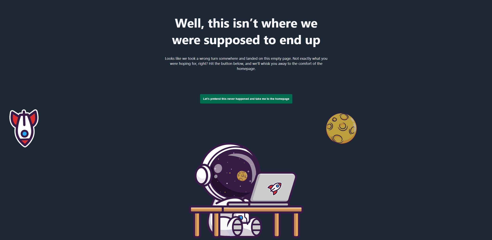

### **Page Not Found**

A modern, animated 404 "Page Not Found" React app with custom illustrations and responsive design.



---

### **Technologies**

- React 19: For building the user interface.
- TypeScript: For type-safe JavaScript development.Vite: As the build tool and development server.
- Less: For writing modular and maintainable CSS.
- ESLint & Prettier: For code linting and formatting.
- @vitejs/plugin-react: For React fast refresh and optimizations.
- typescript-eslint: For TypeScript-aware linting.

---

### **Run the App**

1. Clone the repository:

```bash
https://github.com/Friftycode/page-not-found.git
```

2. Install dependencies:

```bash
npm install
```

3. Start the development server:

```bash
npm run dev
```
